# <Timed-Multiple-Choice-Quiz>

## Description

This project presented me with the opportunity to work with localStorage in the browser as well as getting used to using query selectors, setattribute functions and event listeners. In this project I built a five question multiple choice, timed quiz. The aim of the project was to provide the user with feedback on their correct and incorrect answers - with incorrect answers incurring a time penalty, as well as enabling them to save their score and intials to the browser, which would then show up on the highscores page of the quiz. 

I found this project challenging and had to overcome a few hurdles along the way - for example I originally tried to make one function that all the questions could be passed through, but when the function was called one after the other, rather than displaying question 1 then question 2 when it was called again, question 2 would simply replace the content of question 1. This issue meant I had to rework my code quite a bit, which was a lot of trial and error, but I'm glad that I finally got the questions to appear on the screen in succession.

## Installation

You can access the deployed application at this url: https://emh93.github.io/Timed-Multiple-Choice-Quiz/ 
Click "Start Quiz" to begin.

## Usage

When navigating to the deployed page the user is met with the following instructions on the home screen:

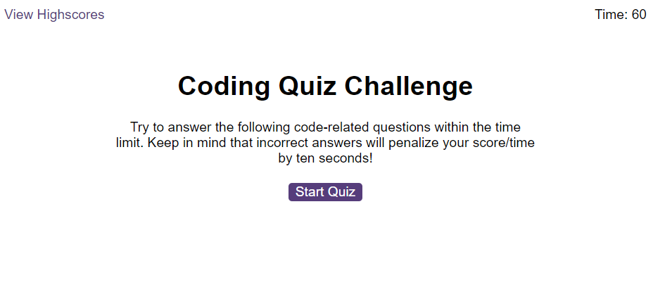

From this home screen the user can choose to start the quiz or visit the current saved highscore. If they visit the highscore page before setting a high score, the user will recieve the following alert and be met with a blank score sheet:

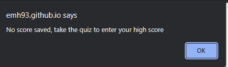
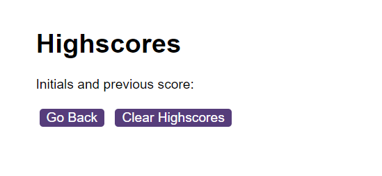

If they navigate back to the home screen using the Go Back button, they can begin the quiz using the "Start Quiz" button. The timer will then begin to count down and the first question will appear on screen:

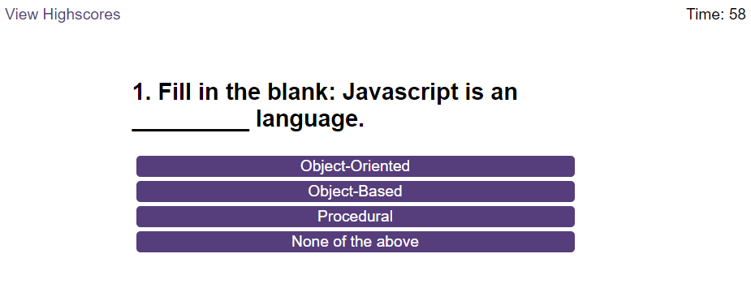

Users will then select their answers. Clicking an answer will load the next question, provide them with feedback on their previous answer, and if they answered incorrectly, will deduct 10 seconds from the timer.

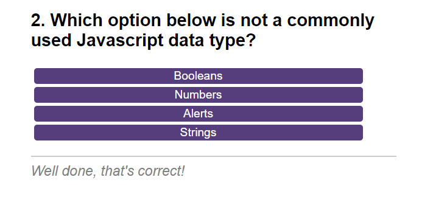
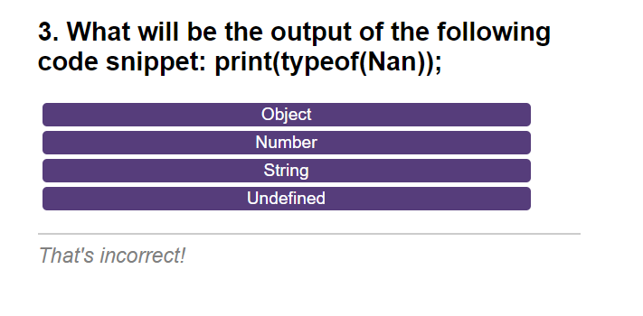

If they run out of time before answering all the questions they will be taken to the loss screen, and prompted to start again from the beginning:

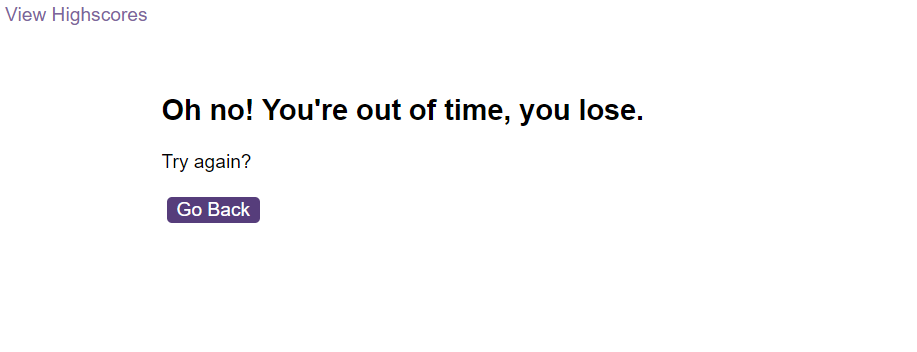

If they complete the quiz before the time runs out, the reminaing time will save to LocalStorage as their score and they will see the following screen asking them to enter their initials to save their score:
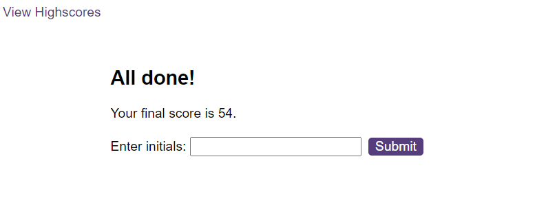

If the user presses submit without entering their initials, they will recieve an alert error asking them to input their initials. If they enter their initials and select submit they will also get an alert saying their input was successful:

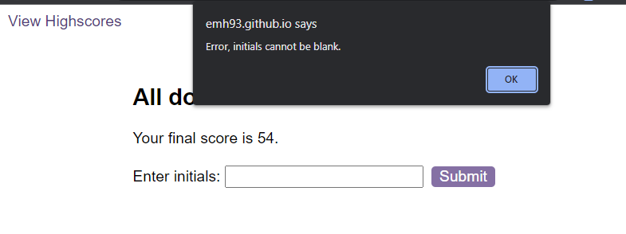
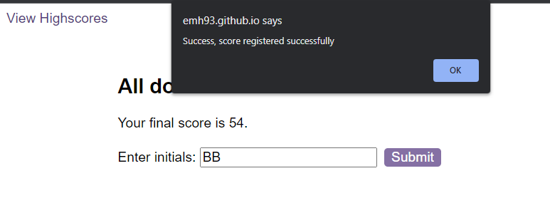

The user can then navigate to the highscore to see their most recent score:

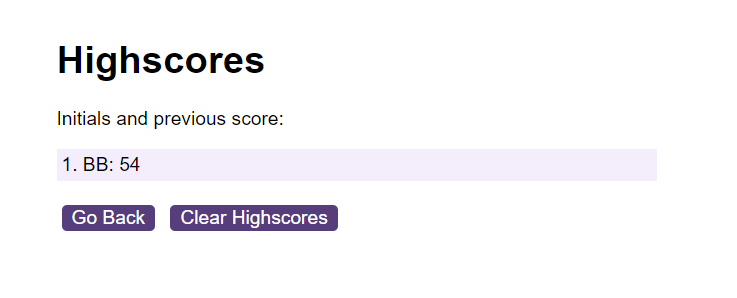

The most recent score can be cleared from the highscore page and local storage by selecting the "Clear Highscore" button.

## Credits

Some questions taken from the following site: https://www.interviewbit.com/javascript-mcq/  

Starter code provided by edX front end developer bootcamp.

## License

MIT license

